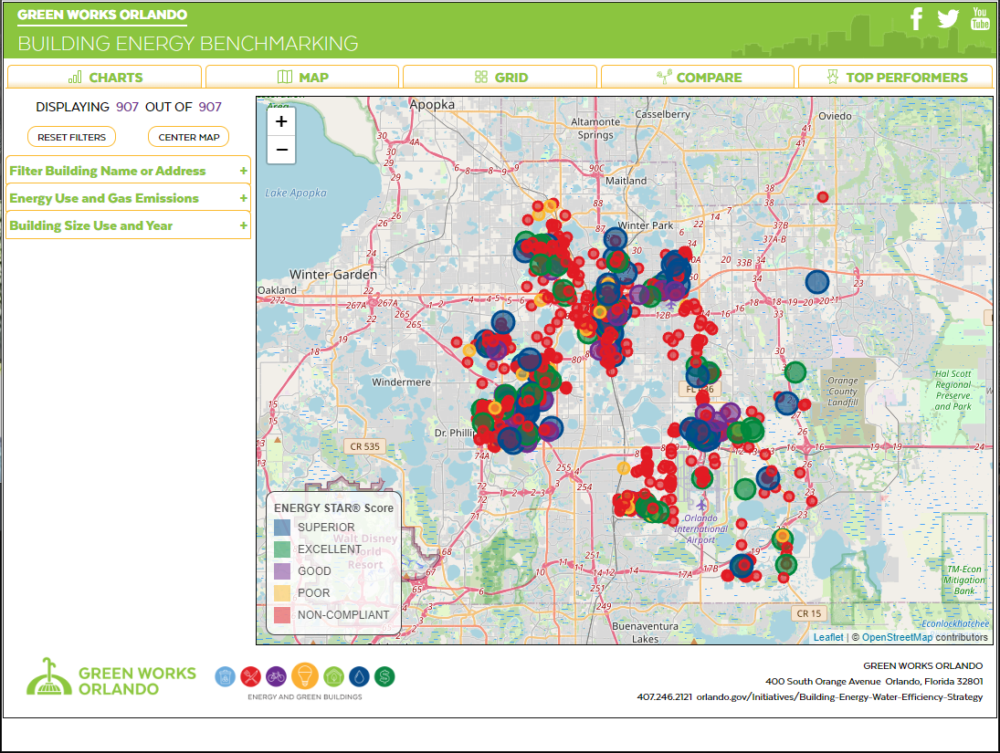
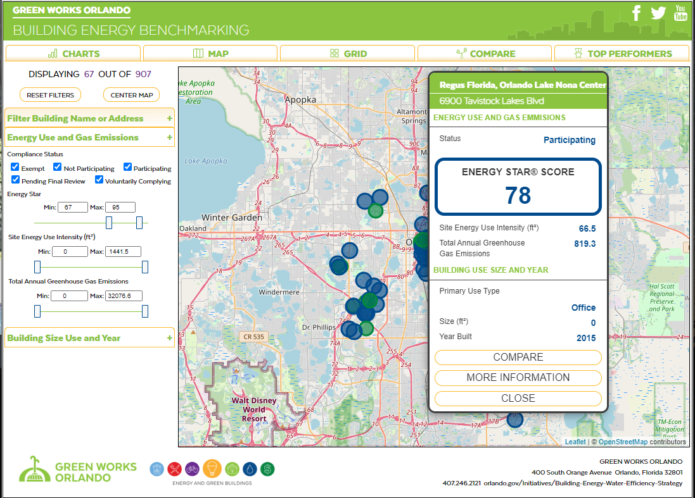
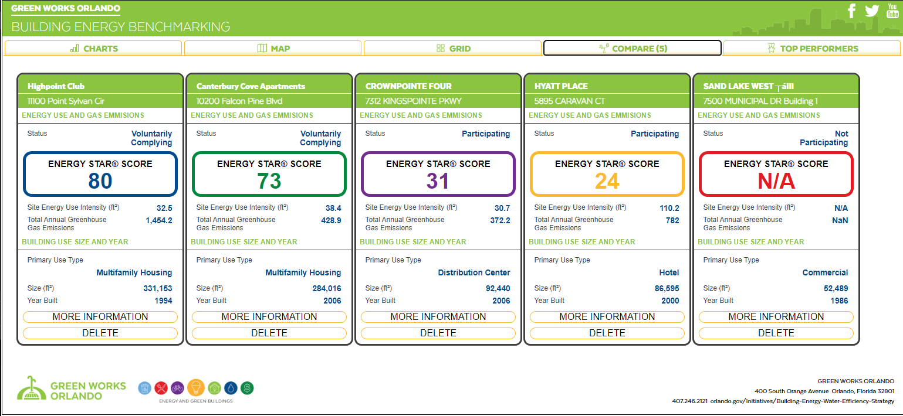
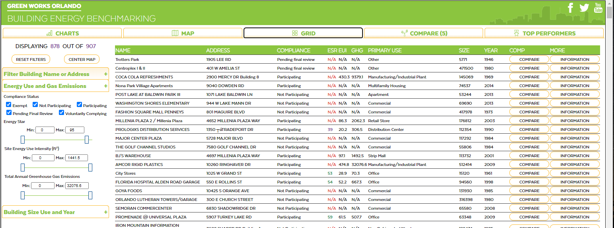
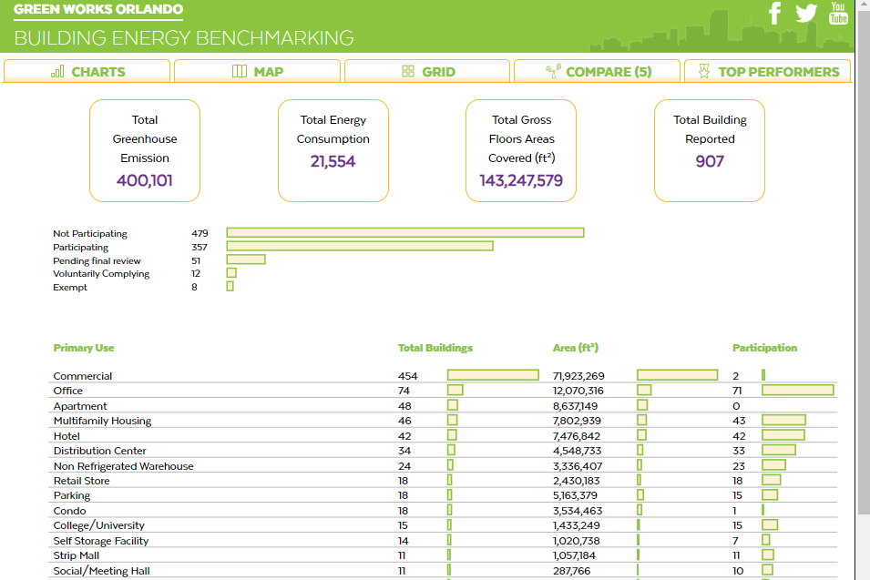

# Orlando Buildings Energy Benchmarking

This project tracks energy and water output for Orlando’s largest buildings. It leverages JavaScript for filtering JSON data, Leaflet for interactive maps, and various graphs and grids for clear data visualization. The user-friendly interface and responsive design ensure accessibility across devices. This initiative aids in enhancing decision-making and energy conservation efforts in the city.

## Live Site

Visit the live project site at [www.orlandobuildingenergy.com](http://www.orlandobuildingenergy.com).


## Style Guide

Refer to the [GreenWorks Style Guide](specs/GreenWorks_StyleGuide.pdf) 
for the official branding and design standards of the City of Orlando GreenWorks initiative.


## Features

- **Data Filtering**: Extensive use of JavaScript to filter JSON data.
- **Interactive Maps**: Utilizes Leaflet for displaying building locations and energy usage.
- **Graphs and Grids**: Various charts to facilitate data dissemination.
- **Responsive Design**: Ensures usability across different devices.
- **User-Friendly Interface**: Easy access and analysis of data.
- **City Guidelines Compliance**: Custom Leaflet popup styles with CSS for consistency.
- **Minimal External Libraries**: Built from scratch without jQuery or other external JavaScript libraries, except for Leaflet.
## Technologies Used

- **Frontend**: HTML, CSS, JavaScript
- **Maps**: Leaflet

## Installation

1. Clone the repository:
    ```bash
    git clone https://github.com/MikeHodges-IT/OrlandoBuildings.git
    ```
2. Navigate to the project directory:
    ```bash
    cd OrlandoBuildings
    ```
3. Open `index.html` in your preferred web browser to view the application.

## Usage

1. Open `index.html` in your web browser.
2. Interact with the map and data visualizations to explore energy and water usage of Orlando's buildings.

## Screenshots



The interactive map displays the locations of Orlando's largest buildings and their energy usage. Users can click on each building to view detailed information in a custom Leaflet pop-up. This feature enhances the user experience by providing relevant information about each building in a visually appealing manner.



The project includes custom Leaflet pop up styles with CSS, which were overwritten to ensure consistency with the city's requirements. This customization not only makes the pop ups visually appealing but also enhances the user experience by providing relevant information about each building when clicked on the interactive map.



The side-by-side comparison feature allows users to compare the energy and water usage of different buildings in Orlando. The interactive map displays multiple buildings simultaneously, with each building represented by a marker. When users click on a marker, a custom Leaflet pop-up appears, providing detailed information about the selected building. This feature enables users to easily compare the energy and water usage data of different buildings, facilitating data analysis and decision-making.




The grid view presents the energy and water usage data of Orlando's buildings in a tabular format. Users can easily sort and filter the data to find specific information. This feature allows for efficient data analysis and comparison.




The chart above illustrates the total greenhouse gas energy consumption for participating and non-participating space buildings in Orlando. It provides a visual comparison of the energy usage between the two groups, allowing for easy analysis and identification of any disparities. This information is crucial for understanding the impact of participation in energy conservation efforts and can aid in decision-making regarding future initiatives.

## Contribution

Feel free to fork this repository, submit issues, and make pull requests. Contributions are welcome!

## License

This project is licensed under the MIT License.

